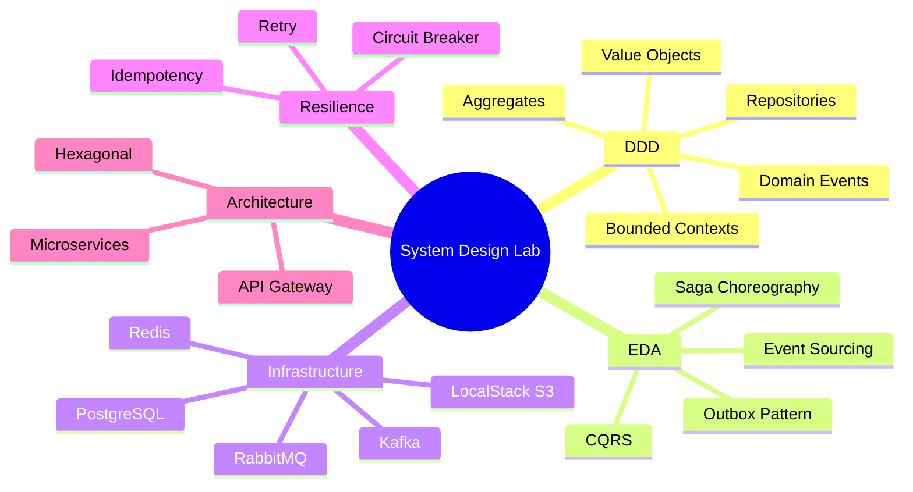

# System Design Lab

A hands-on study lab for learning system design through real implementations.
Each project is a self-contained microservices system built with DDD + EDA patterns.

---

## Learning Goals



---

## Projects

Projects are ordered so each one builds on skills from the previous.
Each project includes an **AWS Equivalent** section (informational only — we build it ourselves to understand it).

| # | Project | Core Patterns & Algorithms | AWS Equivalent |
|---|---------|---------------------------|----------------|
| 01 | Rate Limiter | Token Bucket, Sliding Window, Leaky Bucket, Redis atomics | API Gateway throttling, AWS WAF rate rules |
| 02 | Consistent Hashing | Ring hash, Virtual nodes, Rendezvous hashing | ElastiCache cluster sharding, DynamoDB partitioning |
| 03 | Key-Value Store | LSM Tree, WAL, Bloom Filter, SSTable, compaction | DynamoDB, ElastiCache (Redis/Memcached) |
| 04 | Unique ID Generator | Snowflake ID, Clock drift, bit manipulation | DynamoDB auto-increment, SQS FIFO deduplication IDs |
| 05 | URL Shortener | Base62, CQRS, Cache-Aside, Bloom Filter | Lambda + DynamoDB + CloudFront |
| 06 | Web Crawler | BFS/DFS, URL deduplication, Politeness delay | SQS + Lambda + S3 |
| 07 | Notification System | Fan-out, Push/Pull, Priority queues | SNS (push), SQS (pull), SES (email), Pinpoint (mobile) |
| 08 | News Feed System | Fan-out on Write/Read, Timeline, hybrid ranking | ElastiCache + DynamoDB + Kinesis |
| 09 | Twitter | Social graph, Trending topics, DM + Feed + Search | ElastiCache + DynamoDB + Kinesis + OpenSearch |
| 10 | Chat System | WebSocket, Presence, Message ordering | API Gateway WebSocket, DynamoDB, ElastiCache |
| 11 | Search Autocomplete | Trie, Top-K, Prefix hashing | OpenSearch, CloudSearch |
| 12 | Google Maps | Dijkstra/A*, QuadTree, Spatial indexing, Tile serving | Location Service, OpenSearch geo, CloudFront |
| 13 | YouTube | Video pipeline, Transcoding Saga, CDN | S3 + MediaConvert + CloudFront + SQS |
| 14 | Google Drive | Delta sync, Conflict resolution, versioning | S3 Versioning + DynamoDB + CloudFront |
| 15 | Library System | Rich DDD Aggregates, State machine, Reservation Saga | Step Functions (Saga), DynamoDB, SNS |

---

## Stack (shared across all projects)

| Concern | Technology | Why |
|---|---|---|
| Language | Java 21 | Records, sealed classes, pattern matching — less boilerplate, more expressiveness |
| Framework | Spring Boot 3.3+ | Production-grade, huge ecosystem, excellent testing support |
| Build | Maven multi-module | One parent POM per project, one module per bounded context |
| Event streaming | Apache Kafka | Durable, replayable event log — perfect for Saga and Event Sourcing |
| Task queues | RabbitMQ | Work distribution where replay is not needed |
| Cache | Redis | Distributed, fast, supports atomic operations (used in Rate Limiter too) |
| Database | PostgreSQL | ACID transactions, JSONB for outbox payloads |
| Object storage | LocalStack | Simulates AWS S3 locally — no AWS account needed |
| API simulation | WireMock | Simulates external APIs with configurable failures |
| Resilience | resilience4j | Circuit Breaker, Retry, Rate Limiter, Bulkhead |
| API Gateway | Spring Cloud Gateway | Reactive, routes requests to correct service |
| Containers | Docker + Docker Compose | Reproducible local environment, one command to start everything |
| Testing | JUnit 5 + Mockito + Testcontainers + AssertJ | Full pyramid: unit → integration → e2e |
| API docs | SpringDoc OpenAPI | Auto-generates Swagger UI from annotations |

---

## Architecture Principles (applied everywhere)

### 1. Hexagonal Architecture (Ports & Adapters)

```
        ┌─────────────────────────────────┐
        │           domain/               │
        │   (pure Java, zero Spring)      │
        │                                 │
        │  Aggregates, Value Objects,     │
        │  Domain Services, Port interfaces│
        └────────────┬────────────────────┘
                     │ depends on
        ┌────────────▼────────────────────┐
        │         application/            │
        │  Use Cases, Command/Query       │
        │  objects, transaction boundary  │
        └──────┬──────────────┬───────────┘
               │              │
   ┌───────────▼───┐    ┌─────▼──────────────┐
   │ infrastructure│    │       api/          │
   │ Redis, Kafka, │    │  REST controllers,  │
   │ JPA, clients  │    │  DTOs, mappers      │
   └───────────────┘    └────────────────────┘
```

**Rule:** dependencies always point INWARD. Domain knows nothing about Spring, Redis, or Kafka.

### 2. TDD — Red → Green → Refactor

1. Write a **failing test** that describes the behaviour you want
2. Run it — confirm it fails (Red)
3. Write the **minimum code** to make it pass (Green)
4. Refactor if needed, keep tests green
5. Repeat

### 3. Comment Convention

Every non-trivial class or method carries a one-line comment referencing:

```java
// Pattern: Outbox — atomically persists event with aggregate, prevents lost messages
// Algorithm: Token Bucket — O(1) per request, implemented via Redis INCR + EXPIRE
// Why: BigDecimal not double — floating point arithmetic loses cents at scale
```

Only write comments when the WHY is non-obvious. Never restate the method name.

---

## Interaction Model

| Trigger | What happens |
|---|---|
| `go!` | Claude implements what was just designed |
| Any question | Claude explains only — no code written |
| `how is it going?` | Claude summarises current state |
| `/review` | Spawns code review subagent on completed service |
| `/cost` | Shows current session token cost |
| `/compact` | Compresses conversation history to save tokens |

---

## Git Conventions

- Every git command is shown to you before execution — you run it yourself
- Commit messages: imperative, terse (`add Flight value object with TDD`)
- One commit per meaningful unit (value objects, use case, integration test)
- Repos created per project on GitHub when the first service is complete
