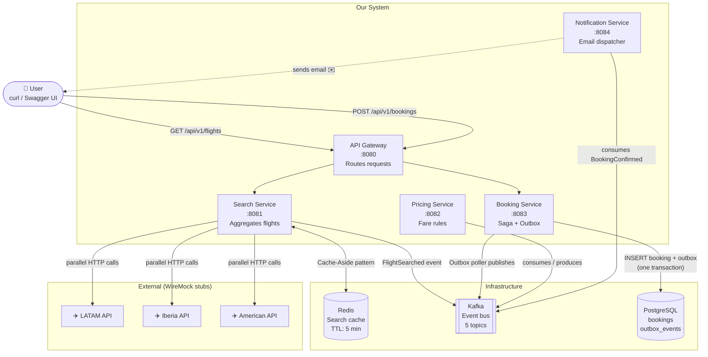
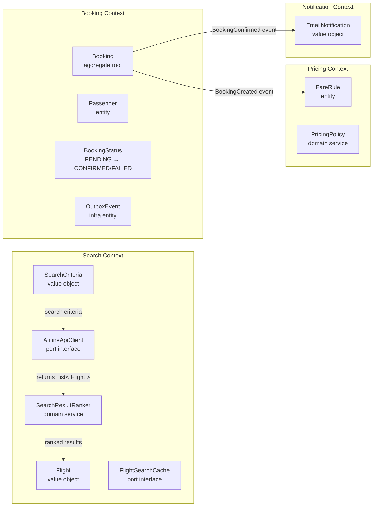
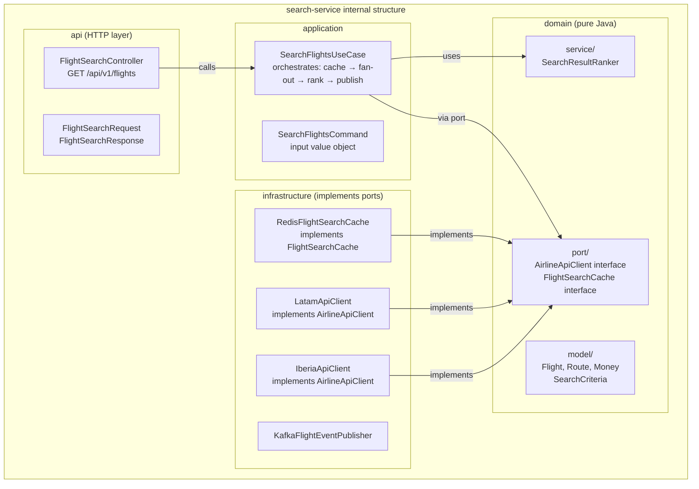
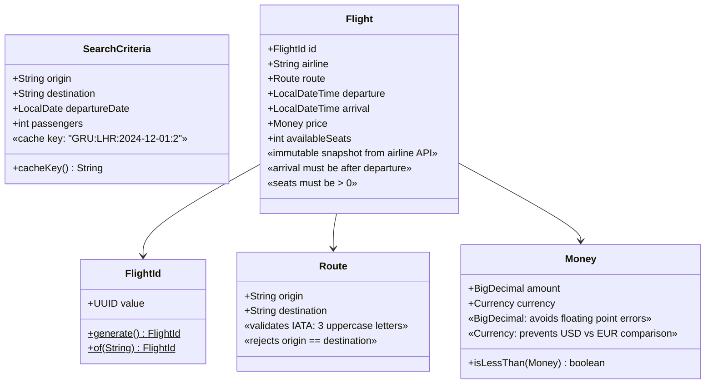
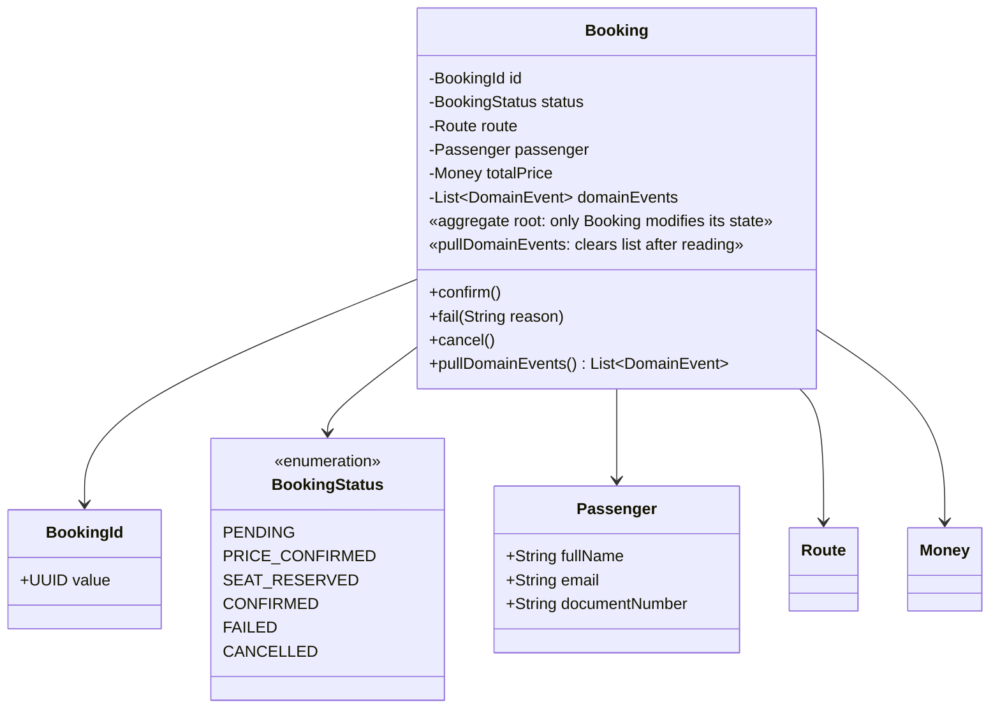
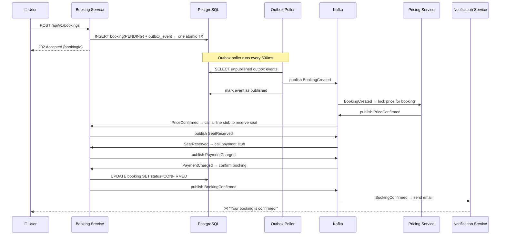
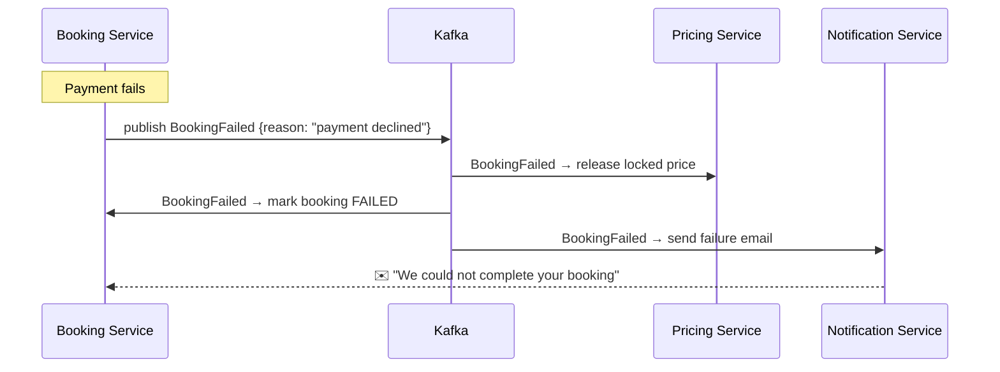
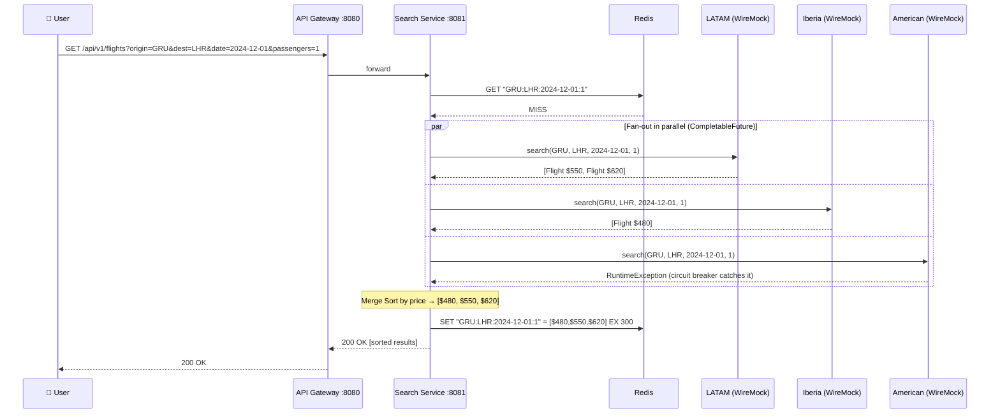

# 01 — Flight Search Aggregator

> **Preview this file in VS Code:** `Ctrl+Shift+V`
> All diagrams below are Mermaid — they render in the preview panel.

---

## Problem Statement

When a user searches for a flight, they want results from *all* airlines at once — not just one.
Each airline (LATAM, Iberia, American, etc.) has its own proprietary API. Our system must:

1. Accept one search request from the user
2. Fan out to N airline APIs **in parallel**
3. Survive failures — if one airline API is down, return results from the others
4. Merge and rank all results by price
5. Cache results to avoid hammering airline APIs on repeated searches
6. Let the user book a flight, reliably, even if parts of the system fail temporarily

This is a **read-heavy, latency-sensitive, distributed system** with **eventual consistency** on the
booking side. Those properties drive every design decision below.

---

## System Context

Who exists in this system and how they communicate:



---

## Bounded Contexts

A **Bounded Context** is a boundary inside which words have a precise, unambiguous meaning.
`Flight` in Search Context is a read-only snapshot. `Booking` in Booking Context is a stateful aggregate.
They never share code — only events cross the boundary.



---

## Architecture: Hexagonal (Ports & Adapters)

Each service is structured so that **business logic never depends on infrastructure**.
The domain layer is pure Java — no Spring, no Redis, no Kafka annotations.



**Dependency rule:** arrows always point inward toward `domain/`. Infrastructure and API layers
depend on domain — never the reverse. This lets us test domain logic with zero infrastructure.

---

## Key Technology Decisions

### Why Redis for caching?

```
Problem: 100 users search GRU→LHR in 5 minutes.
Without cache: 100 × 3 airline API calls = 300 calls, ~500ms each.
With cache:    1 × 3 calls on first search, then 99 × Redis lookup (< 5ms each).

Pattern: Cache-Aside
  1. Check Redis first
  2. On miss: call airlines, store result in Redis (TTL = 5 min)
  3. On hit: return immediately

Why Redis, not local memory cache?
  Multiple instances of search-service share one Redis.
  Local cache = each instance has different data = inconsistent results.
```

### Why Kafka for booking events?

```
Problem: Booking triggers a chain — price lock → seat reserve → payment → email.
If we call these synchronously, one failure breaks everything.
If we retry synchronously, we might double-charge the user.

Kafka solution:
  Each step publishes an event. The next step reacts.
  If payment-service is down, Kafka holds the event until it recovers.
  Each consumer is idempotent (safe to process the same event twice).

Why Kafka and not RabbitMQ here?
  Kafka retains events for 7 days — we can replay.
  RabbitMQ deletes after consumption — no replay.
  For booking flows involving money, replayability matters.
```

### Why the Outbox Pattern?

```
Problem: After saving a booking to PostgreSQL, we publish a Kafka event.
What if Kafka is temporarily down between step 1 and step 2?
  → Booking is saved but saga never starts.
  → User thinks they booked; nothing happens.

Outbox solution: one atomic database transaction writes BOTH:
  INSERT INTO bookings (...)       ← the booking
  INSERT INTO outbox_events (...)  ← the event to be published

A separate poller reads unpublished outbox rows and sends them to Kafka.
If Kafka is down, the poller retries. The event is NEVER lost.

Cost: slight delay (poller runs every 500ms). Acceptable for booking flows.
```

### Why Circuit Breaker (resilience4j)?

```
Problem: LATAM API is slow or down.
Without circuit breaker:
  Every search waits 30s for LATAM timeout.
  All server threads blocked → our service is unresponsive.
  One external failure cascades into our system.

Circuit Breaker states:
  CLOSED  → normal operation, calls go through
  OPEN    → after 5 failures: skip LATAM for 30s, return empty for that airline
  HALF-OPEN → after 30s: send 1 probe call, decide whether to close or stay open

Result: LATAM being down reduces our results by 1 airline — it doesn't kill the service.
```

---

## Data Model

### Search Context — Value Objects (immutable, equality by value)



**Why records?** Java records are immutable by default, auto-generate `equals`, `hashCode`, and
`toString` based on all fields. Perfect for Value Objects — less code, fewer bugs.

**Why `BigDecimal` not `double` for money?**
`double` uses binary floating point: `0.1 + 0.2 = 0.30000000000000004`.
At scale, rounding errors accumulate. One cent off per transaction × millions = disaster.
`BigDecimal` is exact decimal arithmetic. Always use it for money.

**Why `Currency` alongside amount?**
Without it, you could accidentally compare a USD price with a EUR price.
`Currency` makes that comparison a compile-time or runtime-enforced error.

### Booking Context — Aggregate Root (mutable, controls invariants)



**Why is `Booking` a class (not a record)?** Because it's *mutable* — its status changes over
the saga lifecycle. A record is always immutable. Aggregates need to transition state.

**Why `List<DomainEvent> domainEvents` inside `Booking`?**
The aggregate records what happened to itself (e.g. `BookingConfirmed`). The application service
reads these events after calling the aggregate method and publishes them. The aggregate stays
decoupled from Kafka — it just says "this happened", infrastructure decides what to do with it.

**Why `pullDomainEvents()` clears the list?**
Events are meant to be published once. After the application service reads them, they're gone from
the aggregate — prevents double-publishing on the next call.

---

## Event Catalog

Every event is an **immutable record** (past tense — something that *happened*).
Events carry everything the consumer needs — consumers never query back for missing data.

| Event | Producer | Consumers | Kafka Topic |
|---|---|---|---|
| `FlightSearched` | search-service | (analytics — future) | `flight.search.flight-searched` |
| `BookingCreated` | booking-service | pricing-service | `flight.booking.booking-created` |
| `PriceConfirmed` | pricing-service | booking-service | `flight.booking.price-confirmed` |
| `SeatReserved` | booking-service | booking-service | `flight.booking.seat-reserved` |
| `PaymentCharged` | booking-service | booking-service | `flight.booking.payment-charged` |
| `BookingConfirmed` | booking-service | notification-service | `flight.booking.booking-confirmed` |
| `BookingFailed` | booking-service | notification-service | `flight.booking.booking-failed` |

---

## Saga: Booking Flow (Choreography Pattern)

Each service reacts to events and emits the next one.
No central orchestrator — services are loosely coupled.



### Saga Compensation (what happens when it fails)



---

## Flight Search Flow



---

## API Contracts

### Search

```
GET /api/v1/flights
  ?origin=GRU          (required, IATA code)
  ?destination=LHR     (required, IATA code)
  ?date=2024-12-01     (required, ISO date)
  ?passengers=1        (required, min 1 max 9)

200 OK
[
  {
    "id": "uuid",
    "airline": "IB",
    "origin": "GRU",
    "destination": "LHR",
    "departure": "2024-12-01T10:00:00",
    "arrival": "2024-12-01T22:00:00",
    "price": { "amount": 480.00, "currency": "USD" },
    "availableSeats": 42
  },
  ...
]

503 Service Unavailable  — all airline APIs failed (circuit breakers all open)
400 Bad Request          — invalid IATA code or date in the past
```

### Booking

```
POST /api/v1/bookings
{
  "flightId": "uuid",
  "passenger": {
    "fullName": "Roberto Ceccarelli",
    "email": "roberto@example.com",
    "documentNumber": "AB123456"
  }
}

202 Accepted                      ← booking received, saga started asynchronously
{ "bookingId": "uuid" }

GET /api/v1/bookings/{bookingId}
200 OK
{
  "id": "uuid",
  "status": "CONFIRMED",          ← PENDING | CONFIRMED | FAILED | CANCELLED
  "route": { "origin": "GRU", "destination": "LHR" },
  "passenger": { "fullName": "...", "email": "..." },
  "price": { "amount": 480.00, "currency": "USD" }
}
```

---

## Running Locally

```bash
# Start all infrastructure
docker-compose up -d

# Check everything is healthy
docker-compose ps

# Build and test all modules
JAVA_HOME=/usr/lib/jvm/java-21-openjdk-amd64 mvn test -f backend/pom.xml

# Run search-service
JAVA_HOME=/usr/lib/jvm/java-21-openjdk-amd64 mvn spring-boot:run -f backend/pom.xml -pl search-service

# Swagger UI
open http://localhost:8081/swagger-ui.html

# Kafka UI (inspect topics and messages)
open http://localhost:8090
```

---

## Implementation Order

We build in this order so each piece is testable before the next depends on it:

1. `common/` — shared events and exceptions (no Spring)
2. `search-service/domain/` — value objects + domain service (TDD, no Spring)
3. `search-service/application/` — use case (TDD with Mockito)
4. `search-service/infrastructure/` — Redis + WireMock clients (Testcontainers)
5. `search-service/api/` — REST controller (@WebMvcTest)
6. `booking-service/domain/` — Booking aggregate (TDD)
7. `booking-service/application/` — CreateBooking + Outbox (TDD)
8. `booking-service/infrastructure/` — JPA + Kafka + Outbox poller
9. `pricing-service/` — fare rules + Kafka consumer
10. `notification-service/` — Kafka consumer + email stub
11. `api-gateway/` — routing config only
12. Docker Compose integration test — full saga end-to-end
