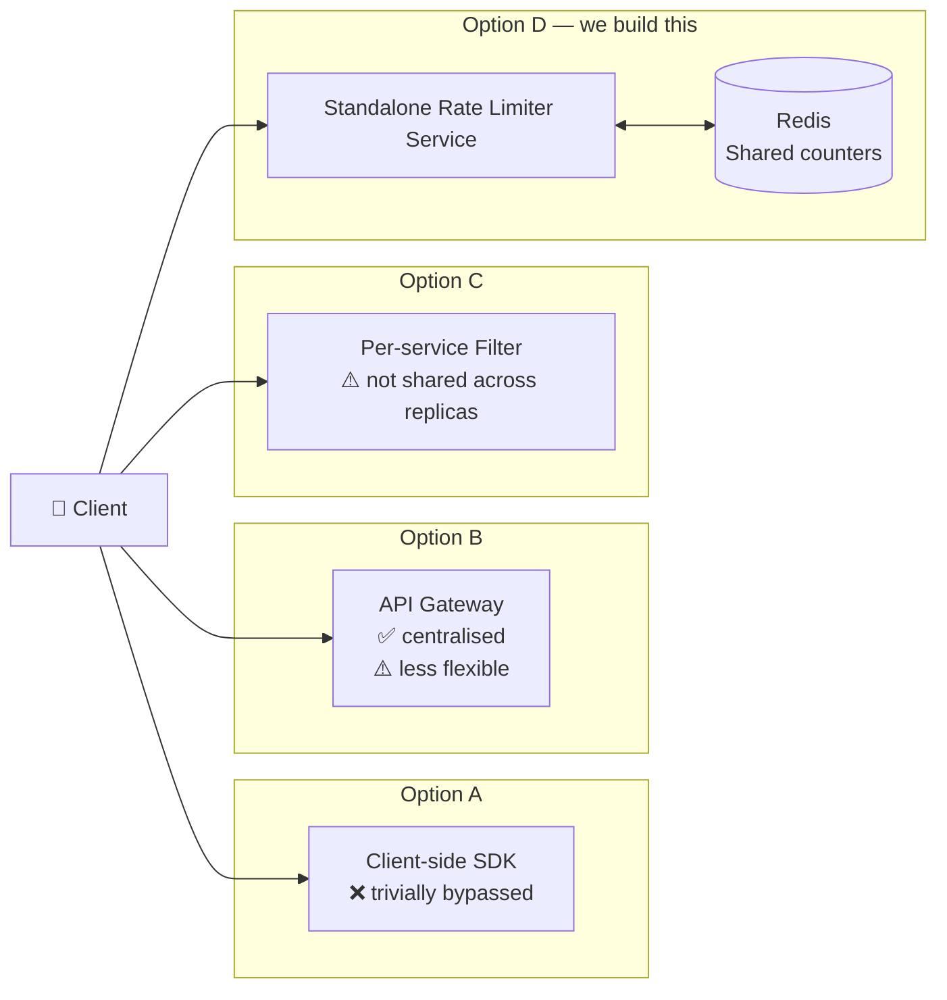
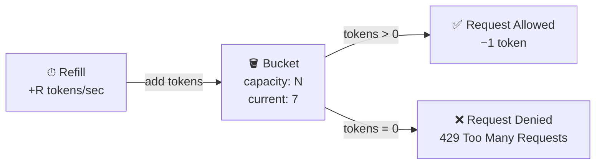
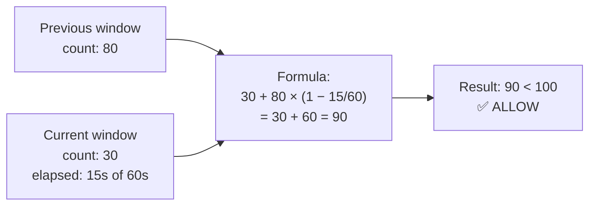
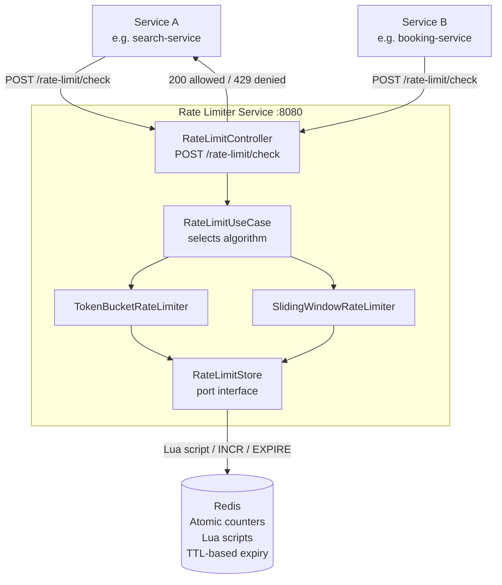
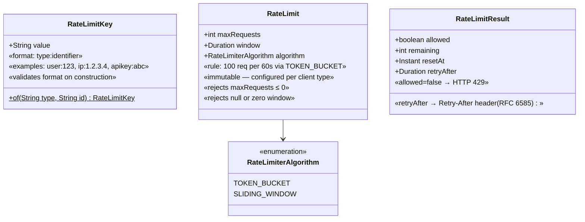

# 01 — Rate Limiter

> **Preview diagrams:** `Ctrl+Shift+V` in VS Code
> **Slides:** open `slides.html` in your browser

---

## Problem Statement

A rate limiter controls how many requests a client can make in a given time window.
Without one:
- A buggy client loops and sends millions of requests → your service crashes
- A scraper hammers your API → data stolen, costs explode
- One noisy tenant starves all other users of capacity
- A DDoS attack takes down your entire platform

**Real limits in production:**
| Company | Limit |
|---|---|
| Twitter API | 300 requests / 15 minutes / user |
| Stripe | 100 requests / second / API key |
| GitHub | 5 000 requests / hour / token |
| OpenAI | Varies by tier, enforced per minute |

---

## Where to Place a Rate Limiter



**Why standalone service?**
Multiple replicas of any service share ONE Redis instance → counters are consistent.
A per-service Spring filter has counters in local memory → each replica counts independently → 3 replicas = 3× the allowed limit in practice.

---

## Algorithms

### Token Bucket ✅ (implemented)



- **Allows bursts:** full bucket = N requests can go through instantly
- **Average rate bounded** by refill rate R
- **O(1) per request** — one atomic Redis counter
- **Redis:** Lua script atomically checks + decrements (no race condition)

**Why Lua scripts?**
`GET` then `DECR` is two separate Redis commands. Between them, another request could slip through. A Lua script executes as a single atomic unit — no interleaving possible.

---

### Sliding Window Counter ✅ (implemented)



**Fixes the boundary burst problem** of Fixed Window.
The further into the current window we are, the less weight the previous window gets.
**O(1)** — two Redis `INCR` calls, one interpolation formula.

---

### Fixed Window Counter ❌ (not implemented — here to show the flaw)

```
Minute 12:00              Minute 12:01
|_____100 req_____________|_____100 req_____________|
                          ↑ boundary

Attack: 100 req at 12:00:59 + 100 req at 12:01:00 = 200 req in 1 second
Limit: 100/min — but attacker got 200 in 2 seconds at the boundary.
```

Simple to implement, easy to exploit. Always use Sliding Window or Token Bucket instead.

---

### Leaky Bucket (informational — not implemented)

Requests enter a queue. Processed at fixed rate. If queue full → reject.
Good for: smoothing output to rate-limited downstream APIs (e.g., payment gateways).
Bad for: general API limiting — adds latency, complex to tune.
**AWS equivalent:** SQS + Lambda with reserved concurrency.

---

## System Context



---

## Data Model



**Why `Duration` for window, not `int seconds`?**
`60` is ambiguous — seconds? milliseconds? `Duration.ofSeconds(60)` is self-documenting. Unit bugs are eliminated at compile time.

**Why `retryAfter` in `RateLimitResult`?**
HTTP 429 standard (RFC 6585) defines `Retry-After` header. Clients that respect it back off automatically — they stop hammering your service and reduce load naturally.

---

## Redis Key Schema

```
Token Bucket:
  key:    "rl:tb:{rateLimitKey}:{windowEpoch}"
  type:   String (integer)
  TTL:    window duration
  ops:    Lua script: GET → if missing set N-1 EX ttl; else DECR → check ≥ 0

Sliding Window:
  current:  "rl:sw:{rateLimitKey}:{currentWindowEpoch}"   TTL: 2× window
  previous: "rl:sw:{rateLimitKey}:{prevWindowEpoch}"      (already exists, just GET)
  ops:      INCR current (atomic), GET previous
```

**Prefix `rl:`** — namespace prevents collisions with other data in the same Redis.
**`{windowEpoch}`** — `Instant.now().getEpochSecond() / windowSeconds` — groups all requests in the same window under one key.

---

## Key Design Decisions

| Decision | Choice | Why |
|---|---|---|
| Storage | Redis | Distributed, atomic ops, TTL auto-cleanup — no cron job needed |
| Atomicity | Lua scripts | GET + DECR must be atomic — Lua is single-threaded in Redis |
| Two algorithms | Token Bucket + Sliding Window | Different use cases: bursts OK vs accuracy at boundary |
| HTTP 429 | Standard response | Clients know to back off; load balancers can detect it |
| Retry-After header | Always included | RFC 6585 compliance; enables automatic client backoff |
| No DB | Redis only | Rate limit state is ephemeral — losing it on restart is acceptable |

---

## AWS Equivalent (informational — not implemented)

| What we build | AWS managed service |
|---|---|
| Token Bucket per API key | **API Gateway Usage Plans** — burst + steady-state rate per key |
| Sliding Window per IP | **AWS WAF rate-based rules** — 5-minute window per IP, auto-block |
| Standalone service | **Lambda Authorizer** — runs before each request, checks DynamoDB counters |
| Redis counters | **ElastiCache (Redis)** — same data structures, managed cluster |
| Lua scripts | Not needed — ElastiCache supports same Lua execution |

---

## Implementation Order

1. `domain/model/` — `RateLimitKey`, `RateLimit`, `RateLimitResult` (Value Objects, TDD)
2. `domain/service/` — `TokenBucketRateLimiter`, `SlidingWindowRateLimiter` (Domain Services, TDD)
3. `domain/port/` — `RateLimitStore` (interface only)
4. `application/` — `RateLimitUseCase` (TDD with Mockito)
5. `infrastructure/redis/` — `RedisRateLimitStore` (Testcontainers integration test)
6. `api/` — `RateLimitController` + DTOs (@WebMvcTest)

---

## Running Locally

```bash
# Start Redis
docker-compose up -d

# Run all tests
JAVA_HOME=/usr/lib/jvm/java-21-openjdk-amd64 mvn test -f backend/pom.xml

# Run the service
JAVA_HOME=/usr/lib/jvm/java-21-openjdk-amd64 mvn spring-boot:run -f backend/pom.xml -pl rate-limiter-service

# Test it
curl -X POST http://localhost:8081/api/v1/rate-limit/check \
  -H "Content-Type: application/json" \
  -d '{"key":"user:123","maxRequests":5,"windowSeconds":60,"algorithm":"TOKEN_BUCKET"}'

# Swagger UI
open http://localhost:8081/swagger-ui.html
```
