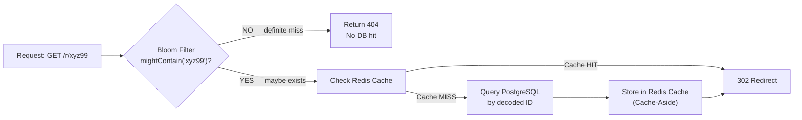
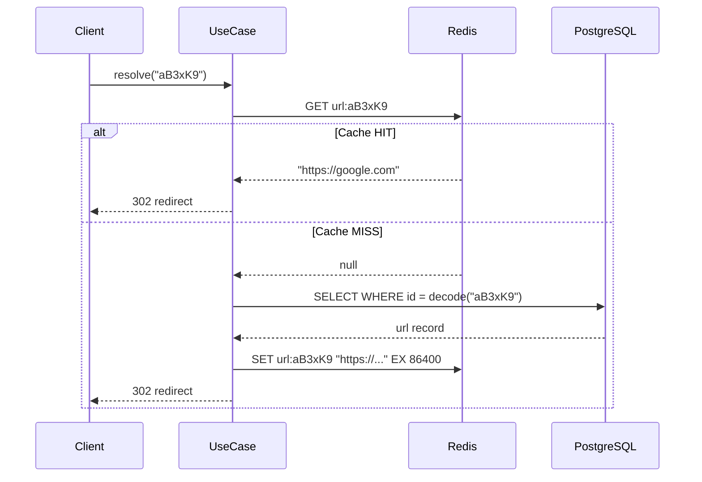
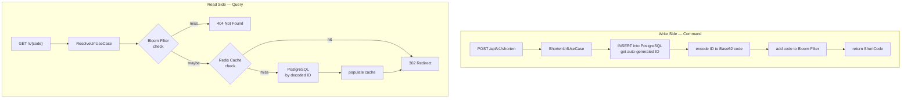
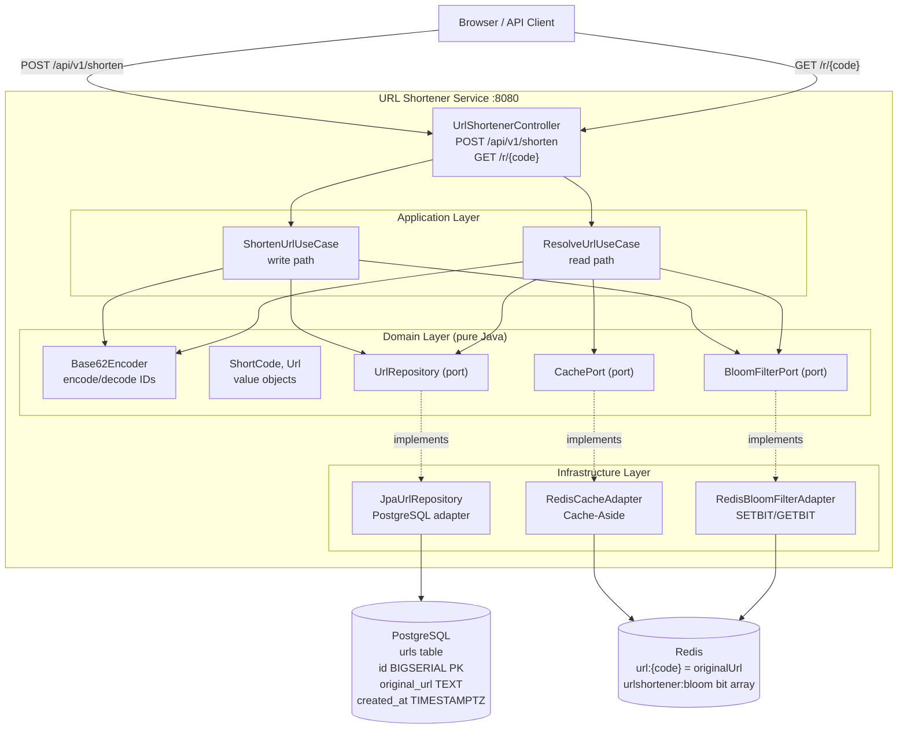
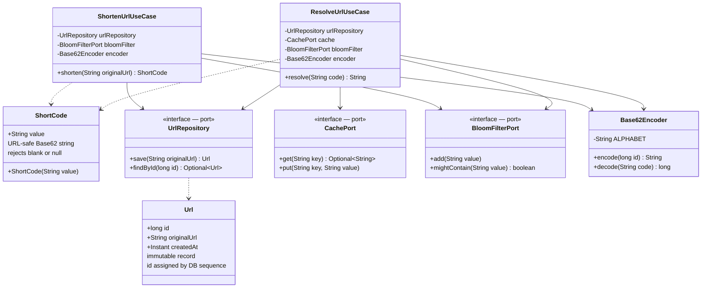

# 05 — URL Shortener

> **Preview diagrams:** `Ctrl+Shift+V` in VS Code

---

## Problem Statement

Given a long URL, produce a short alias (e.g. `https://short.ly/aB3xK9`).
When a user visits the short URL, redirect them to the original.

**Why this is hard at scale:**
- Redirect latency must be < 10ms — cache is mandatory
- Read traffic dwarfs write traffic by 100:1 — system must be read-optimised
- Short codes must be unique — collision handling strategy matters
- Hot links (viral content) get millions of hits — cache-busting attacks are real
- Short codes must be URL-safe — no special characters

---

## Algorithms

### Base62 Encoding

Short codes are generated by encoding an auto-increment database ID into Base62.

**Alphabet:** `0-9 a-z A-Z` → 62 characters, all URL-safe.

**Why not Base64?** Base64 adds `+` and `/` — special characters in URLs. They require percent-encoding (`%2B`, `%2F`), making short codes ugly and fragile.

**Why auto-increment ID over hashing the URL?**

| | Hash URL → take 6 chars | Auto-increment ID → encode |
|---|---|---|
| Collision | Yes — two URLs can produce same prefix | Never — IDs are unique by definition |
| Check needed | Must query DB every write to detect collision | No check needed |
| Performance | O(1) but with DB round-trip on collision | O(1), always |
| Predictability | Non-sequential | Sequential (guessable — acceptable tradeoff) |

**Encoding algorithm** — O(log₆₂ n):

```
ALPHABET = "0123456789abcdefghijklmnopqrstuvwxyzABCDEFGHIJKLMNOPQRSTUVWXYZ"

encode(id):
  while id > 0:
    result.prepend(ALPHABET[id % 62])
    id = id / 62
  return result

decode(code):
  result = 0
  for each char in code:
    result = result * 62 + ALPHABET.indexOf(char)
  return result
```

**Examples:**
```
ID = 1      → "1"
ID = 62     → "10"
ID = 125000 → "W0s"
ID = 56 billion → 6 characters max (62⁶ = 56,800,235,584)
```

**Key insight:** we never store shortCode in the database.
- Shorten: DB gives us auto-generated ID → encode to shortCode
- Resolve: decode shortCode → get ID → query DB by primary key

---

### Bloom Filter

A space-efficient probabilistic data structure that answers "does this short code exist?"



**Properties:**
- **No false negatives** — if filter says NO, the code definitely does not exist
- **~1% false positives** — filter says YES but code might not exist (harmless: just causes a DB miss)

**Why it matters:** without it, someone can enumerate millions of random codes
forcing a DB query on every miss. The Bloom Filter absorbs this at O(1) in memory.

**Implementation:** Redis SETBIT / GETBIT — 3 hash functions, 10M bit array (~1.2MB).

---

### Cache-Aside (Lazy Loading)



The application code manages the cache explicitly — it sits *beside* the DB, not in front of it.
Popular URLs stay hot in cache. Unpopular URLs get evicted by TTL. DB only hit on cold miss.

---

### CQRS (Command Query Responsibility Segregation)

Two completely separate paths through the system — never mixed:



---

## System Context



---

## Data Model



---

## Hexagonal Architecture — Layer Rules

```
        ┌─────────────────────────────────────────┐
        │              domain/                    │
        │  (pure Java, zero Spring, zero Redis)   │
        │                                         │
        │  Url, ShortCode          ← value objects│
        │  Base62Encoder           ← domain svc   │
        │  UrlRepository           ← port         │
        │  CachePort               ← port         │
        │  BloomFilterPort         ← port         │
        │  UrlNotFoundException    ← domain error │
        └──────────────┬──────────────────────────┘
                       │ uses only domain types
        ┌──────────────▼──────────────────────────┐
        │            application/                 │
        │  ShortenUrlUseCase  ← one action        │
        │  ResolveUrlUseCase  ← one action        │
        └──────┬────────────────────┬─────────────┘
               │                    │
  ┌────────────▼────────┐  ┌────────▼────────────┐
  │   infrastructure/   │  │        api/         │
  │  JpaUrlRepository   │  │  UrlShortener       │
  │  RedisCacheAdapter  │  │  Controller         │
  │  RedisBloomFilter   │  │  ShortenRequest     │
  │  Adapter            │  │  ShortenResponse    │
  │  AppConfig          │  │  GlobalException    │
  └─────────────────────┘  │  Handler            │
                           └─────────────────────┘
```

**Rule:** dependencies always point INWARD. Domain knows nothing about Spring, Redis, or JPA.

---

## Key Design Decisions

| Decision | Choice | Why |
|---|---|---|
| ID strategy | Auto-increment (BIGSERIAL) | No collision possible; encode/decode via Base62 |
| ShortCode storage | Not stored in DB | Derived from ID at runtime — no extra column or index |
| Bloom Filter backend | Redis SETBIT/GETBIT | Persistent across restarts; shared across instances |
| Cache strategy | Cache-Aside | App controls cache explicitly; simple to reason about |
| Cache TTL | 24 hours | Balance between memory and DB hit rate |
| Redirect HTTP code | 302 (Found) | 301 is cached by browsers permanently — dangerous for editable links |
| Base62 alphabet | 0-9a-zA-Z | URL-safe, no percent-encoding needed |

---

## AWS Equivalent (informational — not implemented)

| What we build | AWS managed service |
|---|---|
| PostgreSQL + BIGSERIAL | DynamoDB auto-increment or Atomic Counter |
| Redis cache | CloudFront edge caching of 302 responses |
| Redis Bloom Filter | ElastiCache (same Lua/BITSET ops) |
| Spring Boot service | Lambda (shorten) + Lambda (resolve) |
| Docker Compose | API Gateway + Lambda + ElastiCache + RDS |

---

## Implementation Order (TDD)

Follow Red → Green → Refactor strictly.

1. `domain/model/ShortCode` — value object, TDD
2. `domain/model/Url` — aggregate record, TDD
3. `domain/service/Base62Encoder` — encoding algorithm, TDD
4. `domain/port/` — `UrlRepository`, `CachePort`, `BloomFilterPort` (interfaces only, no tests)
5. `domain/UrlNotFoundException` — no test needed
6. `application/usecase/ShortenUrlUseCase` — TDD with Mockito
7. `application/usecase/ResolveUrlUseCase` — TDD with Mockito
8. `infrastructure/persistence/` — JPA entity, Spring Data repo, adapter
9. `infrastructure/cache/RedisCacheAdapter`
10. `infrastructure/bloomfilter/RedisBloomFilterAdapter`
11. `infrastructure/config/AppConfig` — Spring wiring
12. `api/` — controller, DTOs, exception handler
13. `UrlShortenerApplication` — main entry point

---

## Running Locally

```bash
# Start PostgreSQL + Redis
docker-compose up -d

# Run all tests
JAVA_HOME=/usr/lib/jvm/java-21-openjdk-amd64 mvn test -f backend/pom.xml

# Run the service
JAVA_HOME=/usr/lib/jvm/java-21-openjdk-amd64 mvn spring-boot:run -f backend/pom.xml -pl url-shortener-service

# Shorten a URL
curl -X POST http://localhost:8080/api/v1/shorten \
  -H "Content-Type: application/json" \
  -d '{"originalUrl": "https://www.google.com/search?q=consistent+hashing"}'

# Resolve (follow redirect)
curl -L http://localhost:8080/r/1

# Swagger UI
open http://localhost:8080/swagger-ui.html
```
