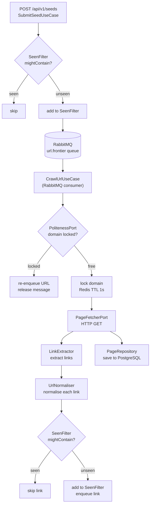
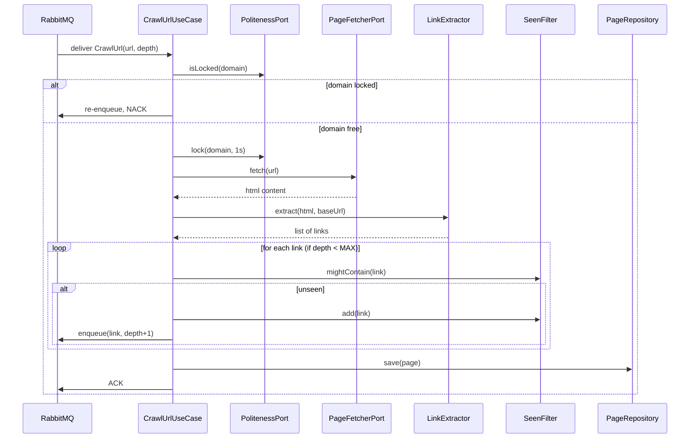
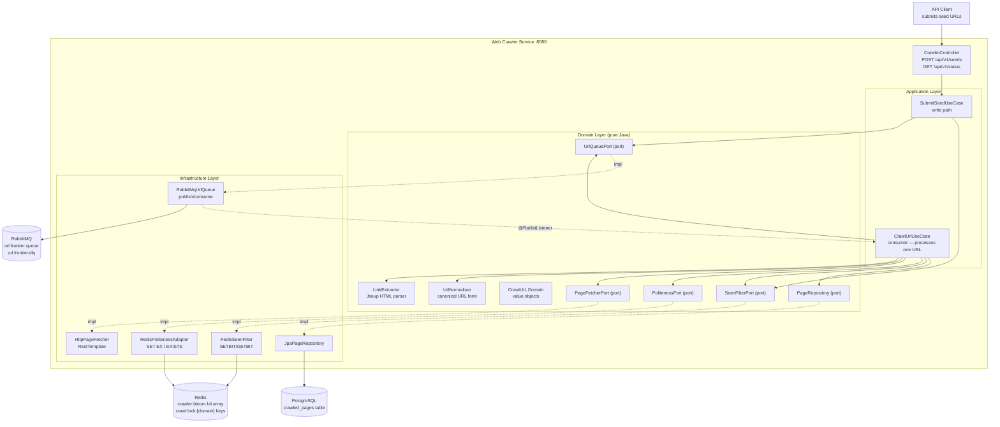

# 06 — Web Crawler

> **Preview diagrams:** `Ctrl+Shift+V` in VS Code
> **Slides:** open `slides.html` in your browser

---

## Problem Statement

A web crawler starts from a set of seed URLs, fetches those pages, extracts all links, and recursively crawls those links. The result is a continuously growing index of the web.

**Why this is hard at scale:**
- The web is a cyclic graph — must detect already-visited URLs or loop forever
- Crawling too fast hammers servers — politeness delays are mandatory
- Sites generate infinite URLs dynamically — need normalisation + depth limits
- Distributed crawlers need a shared work queue — one URL must be processed exactly once

---

## Core Algorithm: BFS

The web is a directed graph. Pages = nodes. Hyperlinks = edges.

```
frontier = Queue([seed_url_1, seed_url_2, ...])
seen     = BloomFilter()

while frontier not empty:
    url = frontier.dequeue()
    if seen.mightContain(url): skip
    seen.add(url)
    page = fetch(url)           ← HTTP GET
    links = extract(page)       ← parse <a href>
    for link in links:
        normalised = normalise(link)
        if not seen.mightContain(normalised):
            seen.add(normalised)
            frontier.enqueue(normalised)
    store(page)
```

**Why BFS not DFS?**
BFS finds important pages first — popular pages are shallow (many sites link to them).
DFS risks crawling 1000 obscure pages before touching an important one.

---

## Algorithms & Patterns

### URL Normalisation

Same page reachable via many different URL strings:
```
https://BBC.COM/News/Article-1          ← uppercase
https://bbc.com/news/article-1#comments ← fragment
https://bbc.com/news/article-1?utm_source=twitter  ← tracking param
https://bbc.com/news/article-1          ← canonical form
```

Normaliser collapses all four to the same string before Bloom Filter check.
Rules: lowercase scheme+host, strip fragment, strip tracking params (`utm_*`, `fbclid`, `gclid`).

### Bloom Filter (Seen URLs)

Same data structure as project 05 — Redis SETBIT/GETBIT.
Added BEFORE enqueuing — prevents the same URL entering the queue multiple times.

### Politeness Delay

Per-domain Redis lock with TTL:
```
after fetching bbc.com/news:
  SET crawl:lock:bbc.com "" EX 1   ← expires in 1 second

next time bbc.com URL dequeued:
  EXISTS crawl:lock:bbc.com → true → re-enqueue, skip for now
```

### Link Extraction

Jsoup parses raw HTML. Extracts all `<a href>` values. Resolves relative URLs against the base URL of the page being crawled.

---

## System Flow



---

## Sequence: Crawl One URL



---

## System Context



---

## Data Model

```mermaid
classDiagram
    class CrawlUrl {
        +String url
        +int depth
        rejects blank url
        rejects negative depth
    }

    class Domain {
        +String value
        extracted from URL host
        always lowercase
        +from(String url) Domain$
    }

    class CrawlPage {
        +String url
        +String htmlContent
        +List~String~ extractedLinks
        +Instant crawledAt
        immutable record
    }

    class UrlNormaliser {
        +normalise(String url) Optional~String~
        lowercase scheme and host
        strip fragment
        strip utm_ fbclid gclid params
        reject non-http schemes
    }

    class LinkExtractor {
        +extract(String html, String baseUrl) List~String~
        Jsoup parse — resolves relative URLs
        filters to http or https only
    }

    class SeenFilterPort {
        <<interface>>
        +add(String url)
        +mightContain(String url) boolean
    }

    class UrlQueuePort {
        <<interface>>
        +enqueue(CrawlUrl crawlUrl)
    }

    class PolitenessPort {
        <<interface>>
        +isLocked(Domain domain) boolean
        +lock(Domain domain)
    }

    class PageFetcherPort {
        <<interface>>
        +fetch(String url) String
    }

    class PageRepository {
        <<interface>>
        +save(CrawlPage page)
        +countCrawled() long
    }
```



---

## Hexagonal Architecture

```
        ┌──────────────────────────────────────────┐
        │              domain/                     │
        │  (pure Java, zero Spring)                │
        │                                          │
        │  CrawlUrl, Domain, CrawlPage  ← models  │
        │  UrlNormaliser, LinkExtractor ← services │
        │  SeenFilterPort               ← port     │
        │  UrlQueuePort                 ← port     │
        │  PolitenessPort               ← port     │
        │  PageFetcherPort              ← port     │
        │  PageRepository               ← port     │
        └──────────────┬───────────────────────────┘
                       │
        ┌──────────────▼───────────────────────────┐
        │            application/                  │
        │  SubmitSeedUseCase  ← seed URLs in       │
        │  CrawlUrlUseCase    ← processes one URL  │
        └──────┬──────────────────────┬────────────┘
               │                      │
  ┌────────────▼──────────┐  ┌────────▼────────────┐
  │    infrastructure/    │  │        api/          │
  │  JpaPageRepository    │  │  CrawlerController   │
  │  RedisSeenFilter      │  │  SeedRequest DTO     │
  │  RabbitMqUrlQueue     │  │  GlobalException     │
  │  RedisPolitenessAdapt │  │  Handler             │
  │  HttpPageFetcher      │  └─────────────────────┘
  │  AppConfig            │
  │  RabbitMqConfig       │
  └───────────────────────┘
```

---

## Key Design Decisions

| Decision | Choice | Why |
|---|---|---|
| Traversal algorithm | BFS | Finds important pages first; DFS risks deep traps |
| URL dedup | Bloom Filter (Redis) | O(1), probabilistic, shared across instances |
| Work queue | RabbitMQ | Work queue pattern — no replay needed; simpler than Kafka |
| Politeness | Redis SET EX | Per-domain TTL lock; atomic, expires automatically |
| HTML parsing | Jsoup | Purpose-built Java HTML parser; handles malformed HTML |
| Max depth | 3 hops from seed | Prevents crawler traps; configurable via application.yml |
| URL normalisation | Strip fragment + tracking params | Collapse duplicate URLs to canonical form |
| Page storage | PostgreSQL | Structured, queryable; JSONB for metadata |

---

## AWS Equivalent (informational — not implemented)

| What we build | AWS |
|---|---|
| RabbitMQ queue | SQS standard queue |
| CrawlUrlUseCase worker | Lambda triggered by SQS |
| PageRepository (PostgreSQL) | S3 (raw HTML) + DynamoDB (metadata) |
| Redis Bloom Filter | ElastiCache |
| Redis politeness lock | ElastiCache SET EX |

---

## Implementation Order (TDD)

1. `domain/model/CrawlUrl` — value object, TDD
2. `domain/model/Domain` — value object, TDD
3. `domain/service/UrlNormaliser` — domain service, TDD
4. `domain/service/LinkExtractor` — domain service, TDD
5. `domain/port/` — all 5 ports (interfaces, no tests)
6. `application/usecase/SubmitSeedUseCase` — TDD with Mockito
7. `application/usecase/CrawlUrlUseCase` — TDD with Mockito
8. `infrastructure/` — all adapters
9. `api/` — controller, DTOs
10. `UrlShortenerApplication`, `application.yml`

---

## Running Locally

```bash
# Start PostgreSQL + Redis + RabbitMQ
docker-compose up -d

# RabbitMQ management UI
open http://localhost:15672   # guest / guest

# Run tests
JAVA_HOME=/usr/lib/jvm/java-21-openjdk-amd64 mvn test -f backend/pom.xml

# Run service
JAVA_HOME=/usr/lib/jvm/java-21-openjdk-amd64 mvn spring-boot:run \
  -f backend/pom.xml -pl web-crawler-service

# Submit seed URLs
curl -X POST http://localhost:8080/api/v1/seeds \
  -H "Content-Type: application/json" \
  -d '{"urls": ["https://wikipedia.org", "https://bbc.com"]}'

# Check crawl status
curl http://localhost:8080/api/v1/status
```
