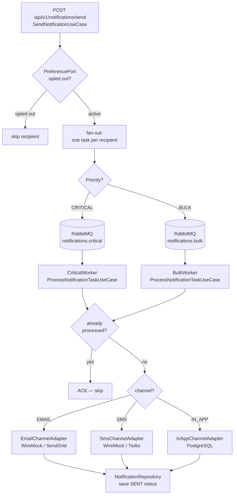
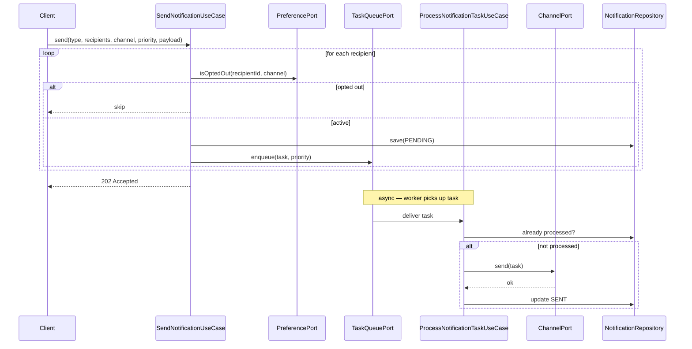
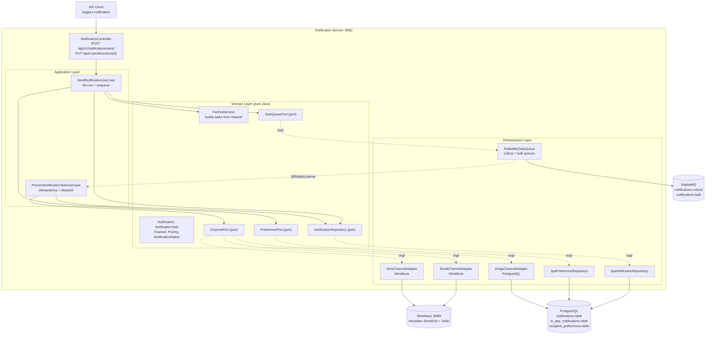

# 07 — Notification System

> **Preview diagrams:** `Ctrl+Shift+V` in VS Code
> **Slides:** open `slides.html` in your browser

---

## Problem Statement

A notification system delivers messages from your application to users across multiple channels (Email, SMS, In-App). At small scale it's a single API call. At scale you face fan-out explosion, channel heterogeneity, priority inversion, provider rate limits, deduplication, and user preferences.

**Core challenge:** send 1 OTP to 1 user in < 1s AND send 1 marketing email to 1M users without blocking the OTP.

---

## Core Patterns

### Fan-out on Write

One send event → one `NotificationTask` per recipient, enqueued immediately.

```
SendNotification(type=ORDER_SHIPPED, recipients=[A, B, C])
        ↓
fan-out → Task(A) Task(B) Task(C)
        ↓           ↓         ↓
    enqueue     enqueue    enqueue
```

**Why not fan-out on read?**
Fan-out on read defers work to query time — fine for social feeds (project 10), wrong for notifications where delivery SLA matters. We want tasks in the queue NOW so workers can start immediately.

### Priority Queues (Two-Lane)

```
CRITICAL lane → notifications.critical queue → dedicated fast consumer
  OTP, password reset, payment alert

BULK lane     → notifications.bulk queue    → rate-limited consumer
  marketing, newsletters, weekly digest
```

Separate queues = separate consumers = CRITICAL never waits behind BULK.

### Strategy Pattern (Channels)

Each channel is a `ChannelPort` implementation. `ProcessNotificationTaskUseCase` selects the right one at runtime based on `task.channel()`.

```
EMAIL → EmailChannelAdapter  (WireMock simulates SendGrid)
SMS   → SmsChannelAdapter    (WireMock simulates Twilio)
IN_APP → InAppChannelAdapter (PostgreSQL — stored, polled by frontend)
```

Adding a new channel = new adapter + register in AppConfig. No other code changes.

### Idempotency

Each `NotificationTask` carries a UUID. Workers check if already processed before sending — prevents double delivery on RabbitMQ retry.

---

## System Flow



---

## Sequence: Send Notification



---

## System Context



---

## Data Model

```mermaid
classDiagram
    class Notification {
        +UUID id
        +String type
        +String recipientId
        +Channel channel
        +Priority priority
        +String payload
        +NotificationStatus status
        +Instant createdAt
        immutable record
    }

    class NotificationTask {
        +UUID notificationId
        +String recipientId
        +Channel channel
        +Priority priority
        +String payload
        value object — one per recipient
    }

    class Channel {
        <<enumeration>>
        EMAIL
        SMS
        IN_APP
    }

    class Priority {
        <<enumeration>>
        CRITICAL
        BULK
    }

    class NotificationStatus {
        <<enumeration>>
        PENDING
        SENT
        FAILED
    }

    class RecipientPreference {
        +String recipientId
        +Channel channel
        +boolean optedOut
        value object
    }

    class TaskQueuePort {
        <<interface>>
        +enqueue(NotificationTask task, Priority priority)
    }

    class PreferencePort {
        <<interface>>
        +isOptedOut(String recipientId, Channel channel) boolean
        +save(RecipientPreference preference)
    }

    class ChannelPort {
        <<interface>>
        +send(NotificationTask task)
        +supports(Channel channel) boolean
    }

    class NotificationRepository {
        <<interface>>
        +save(Notification notification)
        +findById(UUID id) Optional~Notification~
        +existsSent(UUID notificationId) boolean
    }
```



---

## Hexagonal Architecture

```
        ┌──────────────────────────────────────────────┐
        │                  domain/                     │
        │  (pure Java, zero Spring)                    │
        │                                              │
        │  Notification, NotificationTask  ← models   │
        │  Channel, Priority, Status       ← enums    │
        │  RecipientPreference             ← model    │
        │  FanOutService                   ← service  │
        │  NotificationRepository          ← port     │
        │  TaskQueuePort                   ← port     │
        │  PreferencePort                  ← port     │
        │  ChannelPort                     ← port     │
        └──────────────┬───────────────────────────────┘
                       │
        ┌──────────────▼───────────────────────────────┐
        │              application/                    │
        │  SendNotificationUseCase  ← fan-out + enqueue│
        │  ProcessNotificationTask  ← dispatch         │
        └──────┬────────────────────────┬──────────────┘
               │                        │
  ┌────────────▼──────────┐  ┌──────────▼─────────────┐
  │    infrastructure/    │  │          api/           │
  │  JpaNotificationRepo  │  │  NotificationController │
  │  RabbitMqTaskQueue    │  │  PreferenceController   │
  │  JpaPreferenceRepo    │  │  DTOs + mappers         │
  │  EmailChannelAdapter  │  │  GlobalExceptionHandler │
  │  SmsChannelAdapter    │  └────────────────────────┘
  │  InAppChannelAdapter  │
  │  AppConfig            │
  │  RabbitMqConfig       │
  └───────────────────────┘
```

---

## Key Design Decisions

| Decision | Choice | Why |
|---|---|---|
| Fan-out strategy | Fan-out on write | Delivery SLA > storage cost; tasks in queue immediately |
| Priority isolation | Two separate queues | CRITICAL never waits behind BULK; independent scaling |
| Channel abstraction | Strategy pattern (ChannelPort) | Add new channel without touching use case |
| Idempotency | UUID per task, check before send | Prevents double delivery on RabbitMQ retry |
| External providers | WireMock | No real SendGrid/Twilio account needed; configurable failures |
| In-app storage | PostgreSQL | Structured, queryable; frontend polls `/notifications/inbox` |
| Preference check | Before fan-out | Saves queue slots — don't enqueue what you'll skip |

---

## AWS Equivalent (informational — not implemented)

| What we build | AWS |
|---|---|
| RabbitMQ critical queue | SNS → SQS FIFO (ordered, deduped) |
| RabbitMQ bulk queue | SNS → SQS standard (high throughput) |
| EmailChannelAdapter | SES |
| SmsChannelAdapter | Pinpoint / SNS SMS |
| WireMock | LocalStack SNS |

---

## Implementation Order (TDD)

1. `domain/model/` — `Notification`, `NotificationTask`, `RecipientPreference`, enums
2. `domain/service/FanOutService` — TDD
3. `domain/port/` — all 4 ports
4. `application/usecase/SendNotificationUseCase` — TDD
5. `application/usecase/ProcessNotificationTaskUseCase` — TDD
6. `infrastructure/` — all adapters + configs
7. `api/` — controllers + DTOs
8. `application.yml`, `WebMockConfig`

---

## Running Locally

```bash
# Start PostgreSQL + Redis + RabbitMQ + WireMock
docker-compose up -d

# RabbitMQ management UI
open http://localhost:15672   # guest / guest

# WireMock stubs already loaded via mappings/ folder
open http://localhost:8089/__admin/mappings

# Run tests
JAVA_HOME=/usr/lib/jvm/java-21-openjdk-amd64 mvn test -f backend/pom.xml

# Run service
JAVA_HOME=/usr/lib/jvm/java-21-openjdk-amd64 mvn spring-boot:run \
  -f backend/pom.xml -pl notification-service

# Send notification
curl -X POST http://localhost:8082/api/v1/notifications/send \
  -H "Content-Type: application/json" \
  -d '{
    "type": "OTP",
    "recipients": ["user-1", "user-2"],
    "channel": "EMAIL",
    "priority": "CRITICAL",
    "payload": "Your OTP is 847291"
  }'

# Opt out of SMS
curl -X PUT http://localhost:8082/api/v1/preferences/user-1 \
  -H "Content-Type: application/json" \
  -d '{"channel": "SMS", "optedOut": true}'

# Check in-app inbox
curl http://localhost:8082/api/v1/notifications/inbox/user-1
```
