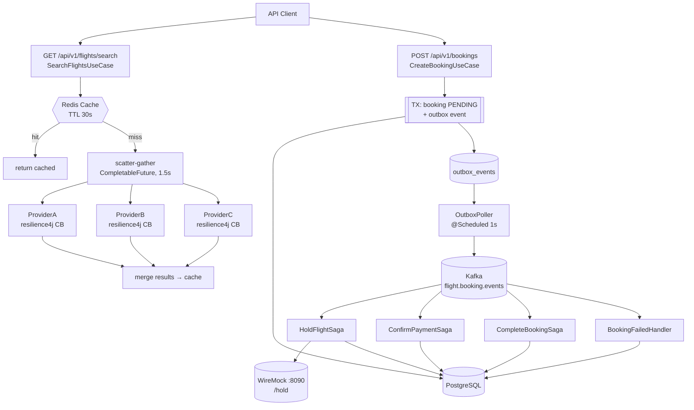
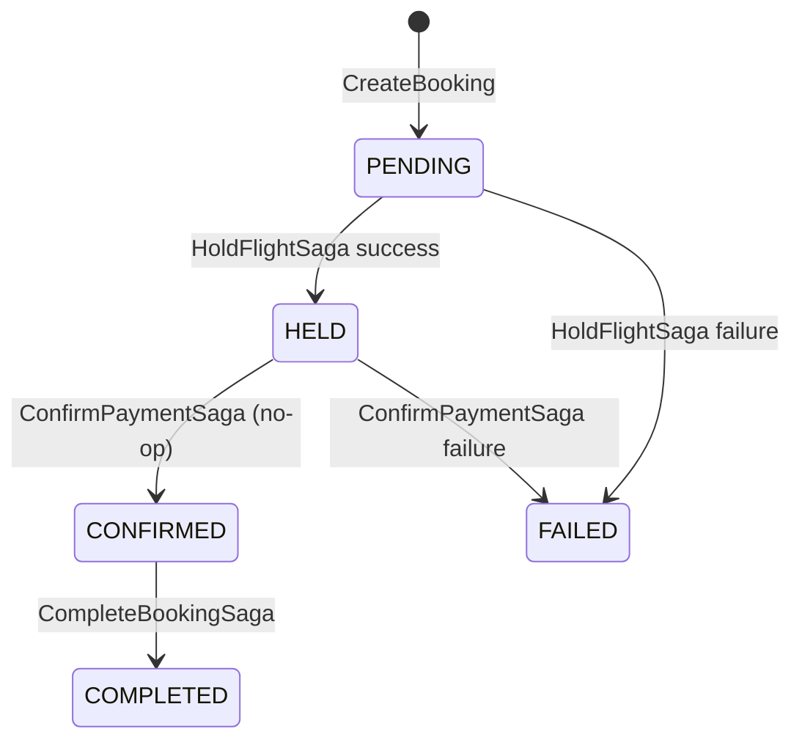
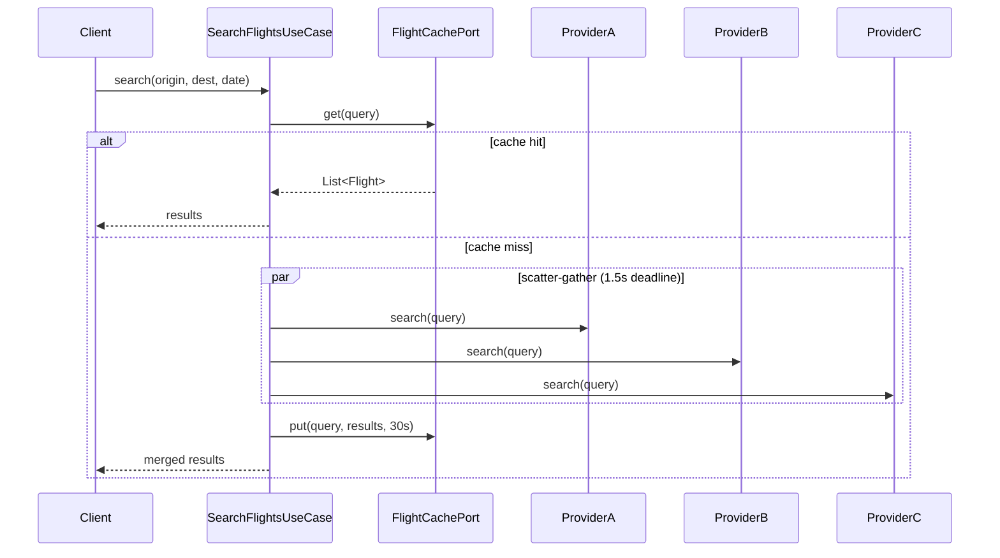
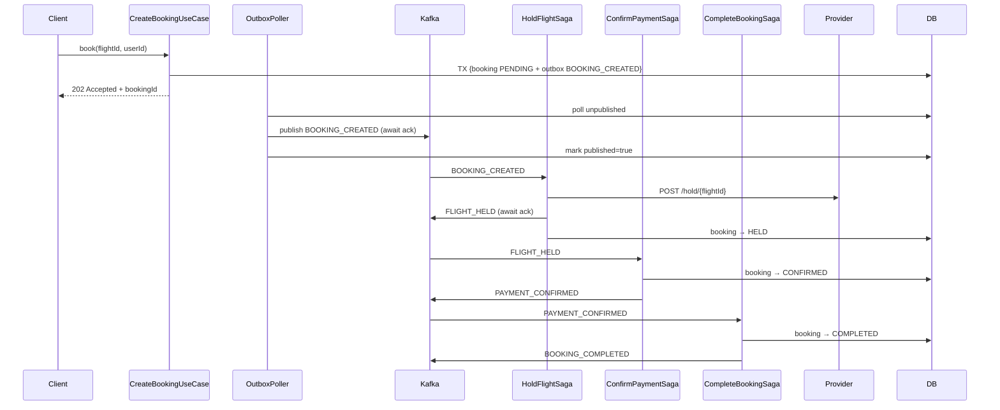

# 08 — Flight Aggregator

> **Preview diagrams:** `Ctrl+Shift+V` in VS Code
> **Slides:** open `slides.html` in your browser

---

## Problem Statement

A flight aggregator queries multiple airline APIs in parallel, merges results, and returns them within a strict latency SLA. The hard part: one slow or failing provider must not block the response. At booking time, holding a seat across a distributed system requires a Saga to maintain consistency across steps that can each fail independently.

**Core challenge:** return merged results from 3 providers in < 2s even if one hangs, AND book a flight reliably without double-charging or leaving a ghost hold.

---

## Core Patterns

### Scatter-Gather with Deadline

Fan-out all provider calls in parallel (CompletableFuture). Wait at most 1.5s. Return whatever responded — partial results beat timeout.

```
SearchQuery
    ↓ parallel
  ProviderA.search()  ProviderB.search()  ProviderC.search()
    ↓ 1.5s deadline
  merge(responded only) → cache → return
```

### Circuit Breaker (per provider)

Each provider adapter is wrapped in a resilience4j Circuit Breaker. If a provider fails repeatedly, the CB opens and calls fail-fast (no timeout wait). The scatter-gather treats CB-open as an empty result.

```
CLOSED  → calls go through
OPEN    → fail-fast (no HTTP call, skip provider)
HALF_OPEN → probe one call, re-close if ok
```

### Cache-Aside (Redis, TTL 30s)

```
search(query) →
  cache.get(key) → HIT  → return cached
                → MISS → scatter-gather → cache.put(key, results, 30s) → return
```

Flight prices are volatile — 30s TTL balances freshness vs provider load.

### Outbox Pattern

`CreateBookingUseCase.create()` is `@Transactional` — booking row (PENDING) and `outbox_events` row commit atomically. `OutboxPoller` (`@Scheduled` 1s) calls `kafka.send().get()` to await broker ack before calling `markPublished()`. If Kafka send fails the row stays `published=false` and is retried on the next tick — at-least-once delivery.

```
@Transactional:
  bookings ← PENDING
  outbox_events ← BOOKING_CREATED (published=false)
↓ (async, every 1s)
OutboxPoller:
  kafka.send().get()       ← blocks until broker acks
  markPublished(event.id)  ← only after ack; retry if send throws
```

### Choreography Saga

Each saga step consumes a Kafka event, performs work, and publishes the next event. No central coordinator — each handler is independent.

```
BOOKING_CREATED  → HoldFlightSaga    → provider /hold   → FLIGHT_HELD | BOOKING_FAILED
FLIGHT_HELD      → ConfirmPaymentSaga → (no-op payment) → PAYMENT_CONFIRMED | BOOKING_FAILED
PAYMENT_CONFIRMED → CompleteBookingSaga                 → BOOKING_COMPLETED
BOOKING_FAILED   → BookingFailedHandler                 → DB: FAILED (no rollback)
```

---

## System Flow



---

## Booking State Machine



---

## Sequence: Search Flights



---

## Sequence: Book Flight (Choreography Saga)



---

## Data Model

```mermaid
classDiagram
    class Flight {
        +String flightId
        +String origin
        +String destination
        +Instant departureTime
        +BigDecimal price
        +String provider
        value object
    }

    class SearchQuery {
        +String origin
        +String destination
        +LocalDate date
        +String cacheKey()
        value object
    }

    class Booking {
        +UUID id
        +String flightId
        +String userId
        +String provider
        +BigDecimal price
        +BookingStatus status
        +Instant createdAt
        aggregate
    }

    class BookingStatus {
        <<enumeration>>
        PENDING
        HELD
        CONFIRMED
        COMPLETED
        FAILED
    }

    class OutboxEvent {
        +UUID id
        +UUID aggregateId
        +String eventType
        +String payload
        +boolean published
        +Instant createdAt
        value object
    }

    class FlightProviderPort {
        <<interface>>
        +String providerId()
        +List~Flight~ search(SearchQuery)
        +String hold(String flightId)
    }

    class FlightCachePort {
        <<interface>>
        +Optional~List~Flight~~ get(SearchQuery)
        +void put(SearchQuery, List~Flight~)
    }

    class BookingRepository {
        <<interface>>
        +void save(Booking)
        +Optional~Booking~ findById(UUID)
        +void updateStatus(UUID, BookingStatus)
    }

    class OutboxPort {
        <<interface>>
        +void save(OutboxEvent)
        +List~OutboxEvent~ findUnpublished()
        +void markPublished(UUID)
    }
```



---

## Hexagonal Architecture

```
        ┌──────────────────────────────────────────────────┐
        │                  domain/                         │
        │  Flight, SearchQuery, Booking, OutboxEvent       │
        │  BookingStatus                                   │
        │  FlightProviderPort, FlightCachePort             │
        │  BookingRepository, OutboxPort                   │
        └──────────────┬───────────────────────────────────┘
                       │
        ┌──────────────▼───────────────────────────────────┐
        │              application/                        │
        │  SearchFlightsUseCase  ← scatter-gather          │
        │  CreateBookingUseCase  ← outbox write            │
        │  HoldFlightSaga        ← Kafka consumer          │
        │  ConfirmPaymentSaga    ← Kafka consumer (no-op)  │
        │  CompleteBookingSaga   ← Kafka consumer          │
        │  BookingFailedHandler  ← Kafka consumer          │
        └──────┬────────────────────────┬──────────────────┘
               │                        │
  ┌────────────▼──────────┐  ┌──────────▼──────────────────┐
  │    infrastructure/    │  │           api/              │
  │  ProviderA/B/CAdapter │  │  FlightController           │
  │  (resilience4j CB)    │  │  BookingController          │
  │  RedisFlightCache     │  │  DTOs, GlobalExceptionHandler│
  │  JpaBookingRepository │  └────────────────────────────-┘
  │  JpaOutboxRepository  │
  │  OutboxPoller         │
  │  KafkaSagaConsumer    │
  │  KafkaConfig          │
  │  AppConfig            │
  └───────────────────────┘
```

---

## Key Design Decisions

| Decision | Choice | Why |
|---|---|---|
| Aggregation | Scatter-gather, 1.5s deadline | Partial results beat timeout; slow provider must not block |
| Circuit Breaker | Per-provider, resilience4j default | Fail-fast on unhealthy provider; no wait for open CB |
| Cache | Redis Cache-Aside, 30s TTL | Volatile prices; 30s balances freshness vs provider load |
| Saga style | Choreography | Decoupled steps, each independently deployable; orchestration in project 09 |
| Outbox | Atomic booking + event in one TX | Guarantees event delivery even if Kafka is temporarily down |
| Payment | No-op (always succeeds) | Payment is not the learning goal here; Saga state machine is |
| Compensation | DB-only (mark FAILED) | Simpler; provider rollback would require idempotency keys per provider |
| Kafka DLT | DefaultErrorHandler + DeadLetterPublishingRecoverer, 3 retries × 1s | Poison messages route to `.DLT` topic; consumer group never stalls |
| HoldFlightSaga order | Kafka send (await ack) BEFORE DB update | If Kafka fails, DB stays PENDING and catch publishes BOOKING_FAILED — no stuck HELD state |

---

## AWS Equivalent (informational — not implemented)

| What we build | AWS |
|---|---|
| scatter-gather (CompletableFuture) | Lambda fan-out via SNS |
| Circuit Breaker (resilience4j) | API Gateway timeout + retry |
| Redis Cache-Aside | ElastiCache |
| Outbox Poller | DynamoDB Streams → Lambda |
| Kafka (saga events) | EventBridge / SQS FIFO |

---

## Running Locally

```bash
# Start infra
docker-compose up -d

# Run tests
JAVA_HOME=/usr/lib/jvm/java-21-openjdk-amd64 mvn test -f backend/pom.xml

# Run service
JAVA_HOME=/usr/lib/jvm/java-21-openjdk-amd64 mvn spring-boot:run \
  -f backend/pom.xml -pl flight-service

# Search flights
curl "http://localhost:8083/api/v1/flights/search?origin=LHR&destination=JFK&date=2025-06-01"

# Book a flight
curl -X POST http://localhost:8083/api/v1/bookings \
  -H "Content-Type: application/json" \
  -d '{"flightId": "LH-001", "userId": "user-1", "provider": "PROVIDER_A", "price": 450.00}'

# Check booking status
curl http://localhost:8083/api/v1/bookings/{id}
```
