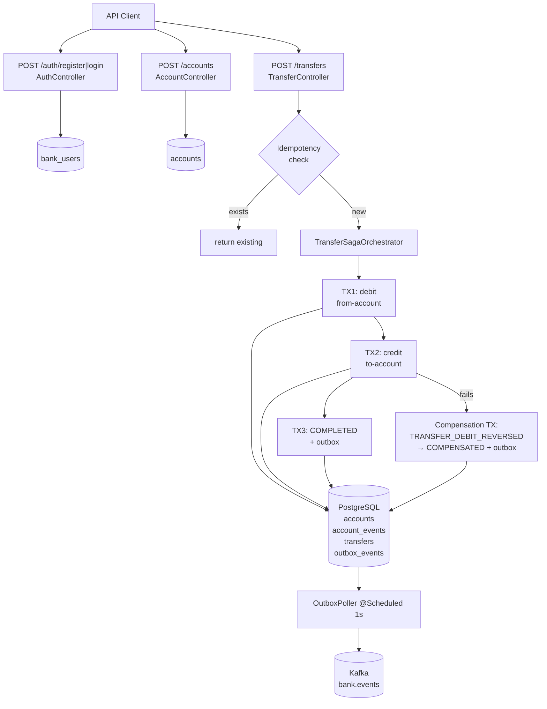
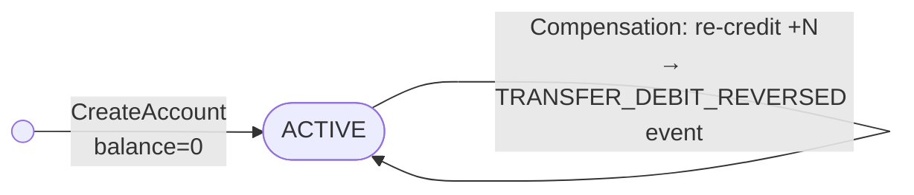
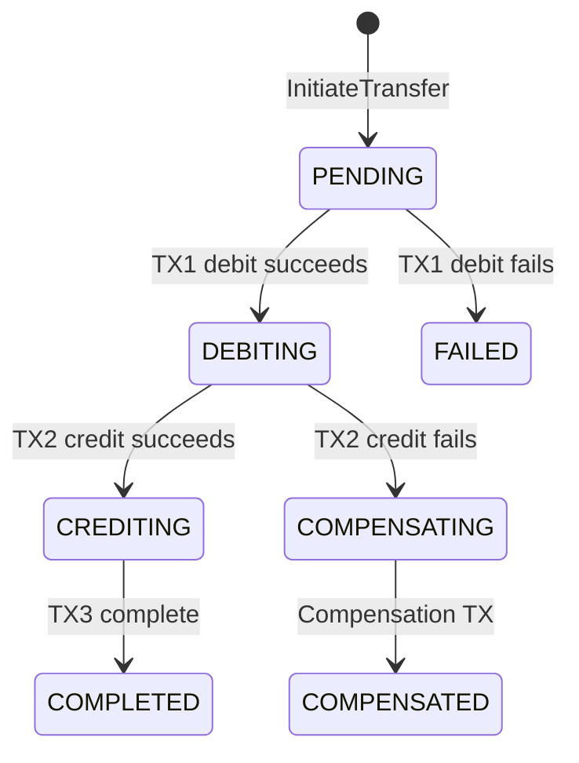
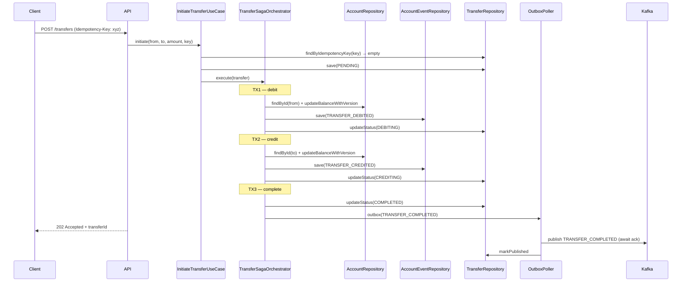
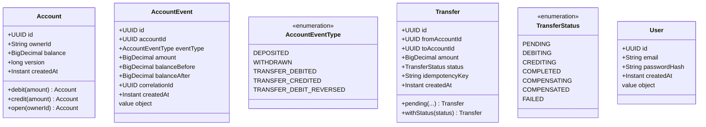

# 09 — Bank System

> **Preview diagrams:** `Ctrl+Shift+V` in VS Code
> **Slides:** open `slides.html` in your browser

---

## Problem Statement

A bank system that handles accounts, deposits, withdrawals, and transfers between accounts. Transfers require a multi-step Saga (debit one account, credit another) with compensation if any step fails. Every account mutation produces an immutable event log. Duplicate transfer requests must be idempotent. All endpoints require JWT authentication.

**Core challenge:** transfer money reliably across two accounts — either both sides succeed or the system compensates back to a consistent state, with a full audit trail of every mutation.

---

## Core Patterns

### Hybrid Event Sourcing

Both a `balance` column (current snapshot) and an `account_events` table (immutable log) are maintained. Balance is updated on every mutation; events are appended and never modified.

```
Full Event Sourcing:  balance = replay(all events)  — O(n) reads, no balance column
Hybrid (this project): balance column + event log    — O(1) reads, full audit trail
```

Why hybrid: the learning goal is the event log and audit trail, not snapshot management. Full event sourcing adds snapshot/projection complexity that is out of scope here.

### Orchestration Saga

A single `TransferSagaOrchestrator` drives each step imperatively. No events needed between steps — the orchestrator knows the sequence and handles failures directly.

```
PENDING → [TX1: debit] → DEBITING → [TX2: credit] → CREDITING → [TX3: complete] → COMPLETED
                │                         │
              fails                     fails
                │                         │
           FAILED                   [compensation TX]
                                    COMPENSATING → COMPENSATED
```

Each saga step runs in its own `TransactionTemplate`-managed transaction so failures don't roll back earlier steps. Compensation re-credits the source account.

Contrast with Choreography (project 08): orchestration is easier to reason about when steps are sequential and live in one service. Choreography scales better across independent services.

### Outbox Pattern

Same as project 08 — final saga outcome (TRANSFER_COMPLETED / TRANSFER_FAILED) written atomically with the status update. `OutboxPoller` publishes to Kafka with `kafka.send().get()` before `markPublished()`.

### Idempotency

Client supplies `Idempotency-Key: <uuid>` header on `POST /transfers`. The key is stored in a `UNIQUE` column. A duplicate key returns the existing transfer without re-executing the saga.

```
POST /transfers + Idempotency-Key: abc
  → findByIdempotencyKey("abc")
    → found   → return existing transfer (no-op)
    → not found → save + execute saga
```

### JWT Authentication

Stateless JWT. `JwtAuthFilter` parses `Authorization: Bearer <token>`, validates, and sets `SecurityContextHolder`. No session. Passwords hashed with BCrypt.

---

## System Flow



---

## Account Event Log

Account has no lifecycle states — it is always ACTIVE. Each mutation appends an immutable event and updates the balance snapshot.



---

## Transfer Saga State Machine



---

## Sequence: Transfer



---

## Data Model



---

## Hexagonal Architecture

```
        ┌──────────────────────────────────────────────────┐
        │                  domain/                         │
        │  Account, AccountEvent, AccountEventType         │
        │  Transfer, TransferStatus, User, OutboxEvent     │
        │  InsufficientFundsException, OptimisticLockEx    │
        │  AccountRepository, AccountEventRepository       │
        │  TransferRepository, UserRepository, OutboxPort  │
        └──────────────┬───────────────────────────────────┘
                       │
        ┌──────────────▼───────────────────────────────────┐
        │              application/                        │
        │  CreateAccountUseCase  DepositUseCase            │
        │  WithdrawUseCase       InitiateTransferUseCase   │
        │  GetAccountUseCase     GetTransferUseCase        │
        │  TransferSagaOrchestrator  ← drives saga steps  │
        └──────┬────────────────────────┬──────────────────┘
               │                        │
  ┌────────────▼──────────┐  ┌──────────▼──────────────────┐
  │    infrastructure/    │  │           api/              │
  │  JpaAccountRepository │  │  AuthController             │
  │  JpaAccountEventRepo  │  │  AccountController          │
  │  JpaTransferRepository│  │  TransferController         │
  │  JpaUserRepository    │  │  DTOs, GlobalExceptionHandler│
  │  JpaOutboxRepository  │  └────────────────────────────-┘
  │  OutboxPoller         │
  │  JwtService           │
  │  JwtAuthFilter        │
  │  UserDetailsAdapter   │
  │  AppConfig            │
  │  SecurityConfig       │
  │  KafkaConfig          │
  └───────────────────────┘
```

---

## Key Design Decisions

| Decision | Choice | Why |
|---|---|---|
| Event Sourcing | Hybrid (balance column + event log) | O(1) balance reads; audit trail without snapshot complexity |
| Saga style | Orchestration | Single-service flow; orchestrator sees full state; project 08 used choreography |
| Transaction granularity | TransactionTemplate per step | Each saga step commits independently; failures don't roll back earlier steps |
| Optimistic locking | Manual (version column + WHERE version = ?) | Explicit concurrency control — no silent JPA @Version magic |
| Idempotency | Client-provided key, UNIQUE DB constraint | DB enforces uniqueness; duplicate race → DataIntegrityViolationException → 409 |
| Auth | JWT (stateless) | No session storage; scales horizontally; Spring Security + jjwt 0.12 |
| Password | BCrypt | Adaptive hashing; recommended by OWASP |
| Payment | No external payment provider | Payment is not the learning goal; saga state machine is |
| Compensation | Re-credit source account only | Simple and correct; no provider rollback needed |

---

## AWS Equivalent (informational — not implemented)

| What we build | AWS |
|---|---|
| Transfer Saga (TransactionTemplate) | Step Functions (Saga pattern) |
| Outbox Poller | DynamoDB Streams → Lambda |
| Kafka (final events) | EventBridge / SQS FIFO |
| JWT auth | API Gateway + Cognito |
| Optimistic locking (version column) | DynamoDB conditional writes |
| Account event log | DynamoDB Streams / Kinesis |

---

## Running Locally

```bash
# Start infra
docker-compose up -d

# Run tests
JAVA_HOME=/usr/lib/jvm/java-21-openjdk-amd64 mvn test -f backend/pom.xml

# Run service
JAVA_HOME=/usr/lib/jvm/java-21-openjdk-amd64 mvn spring-boot:run \
  -f backend/pom.xml -pl bank-service

# Register + get JWT
TOKEN=$(curl -s -X POST http://localhost:8084/auth/register \
  -H "Content-Type: application/json" \
  -d '{"email":"alice@example.com","password":"secret"}' | jq -r .token)

# Create account
ACCOUNT=$(curl -s -X POST http://localhost:8084/accounts \
  -H "Authorization: Bearer $TOKEN" | jq -r .accountId)

# Deposit
curl -X POST http://localhost:8084/accounts/$ACCOUNT/deposit \
  -H "Authorization: Bearer $TOKEN" \
  -H "Content-Type: application/json" \
  -d '{"amount": 1000}'

# Transfer (idempotent)
curl -X POST http://localhost:8084/transfers \
  -H "Authorization: Bearer $TOKEN" \
  -H "Idempotency-Key: $(uuidgen)" \
  -H "Content-Type: application/json" \
  -d "{\"fromAccountId\":\"$ACCOUNT\",\"toAccountId\":\"<other-id>\",\"amount\":250}"

# Get event log
curl http://localhost:8084/accounts/$ACCOUNT/events \
  -H "Authorization: Bearer $TOKEN"
```
