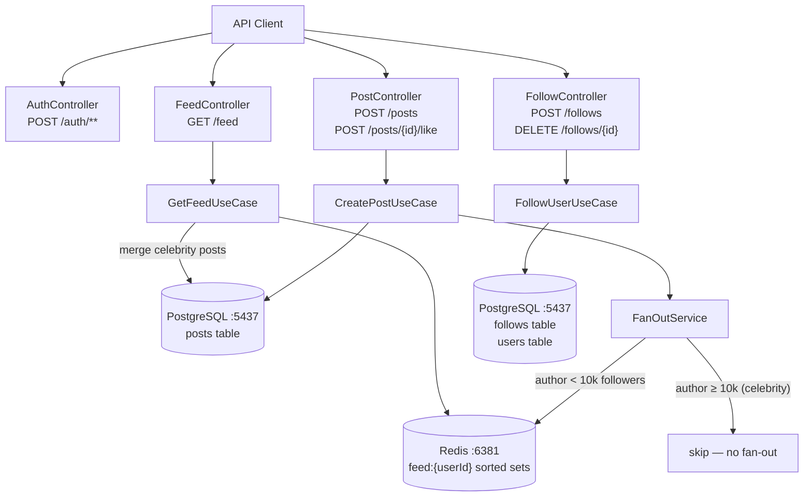
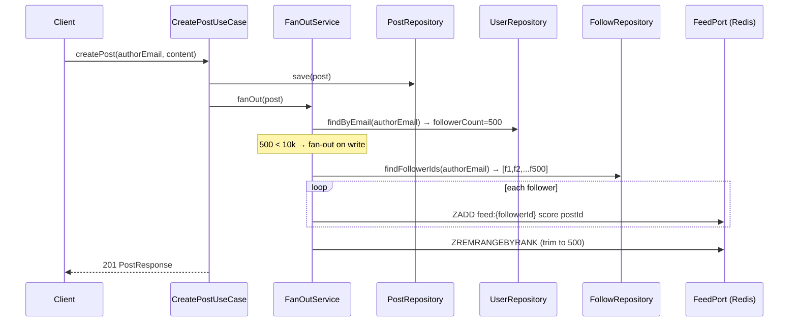
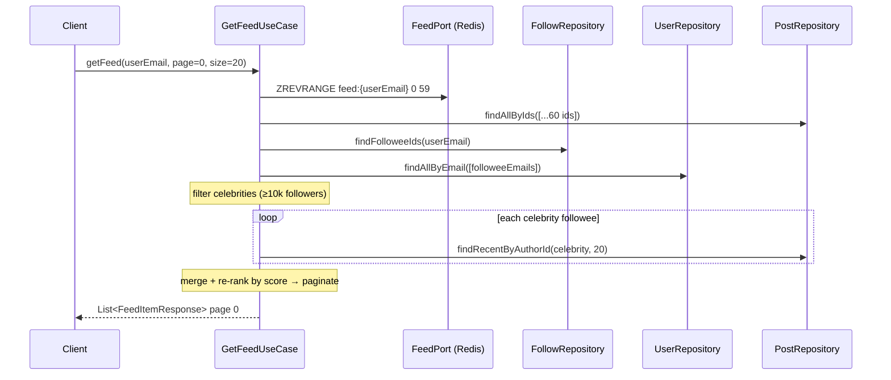
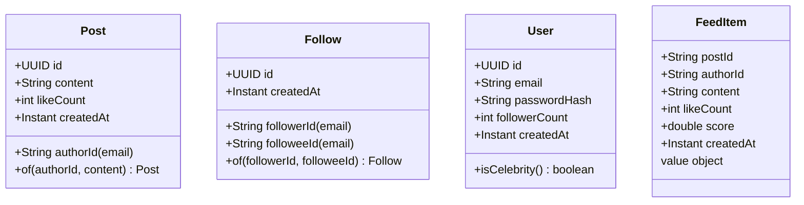

# 10 — News Feed System

> **Preview diagrams:** `Ctrl+Shift+V` in VS Code
> **Slides:** open `slides.html` in your browser

---

## Problem Statement

A social news feed where users post content and see a ranked timeline of posts from people they follow. The hard part: when a celebrity with 500k followers posts, pushing that post to 500k Redis entries is too slow. When a regular user posts, pull-on-read is wasteful — they only have 100 followers.

**Core challenge:** deliver a ranked, paginated feed in < 100ms while handling both high-follower (celebrity) and low-follower (regular) authors efficiently.

---

## Core Patterns

### Fan-out on Write (regular users)

When a regular user (< 10k followers) creates a post, push the post ID + score to every follower's Redis sorted set immediately.

```
POST created by user A (500 followers)
  → for each follower → ZADD feed:{followerId} score postId
  → trim feed to 500 max items
Read: ZREVRANGE feed:{userId} → done
```

### Fan-out on Read (celebrities)

When a celebrity (≥ 10k followers) creates a post, do nothing — too expensive to push to 10k+ sorted sets synchronously.

```
POST created by celebrity B (50k followers)
  → save post only (no Redis writes)
Read: for each followed celebrity → SELECT recent posts → merge
```

### Hybrid Strategy

Combine both. Regular user feed = Redis sorted set. Celebrity posts = merged at read time.

```
GET /feed/{userId}:
  1. ZREVRANGE feed:{userId}  ← pre-built fan-out posts
  2. for each celebrity followee → DB.findRecent(N)
  3. merge + re-rank by hybrid score
  4. paginate → top 20
```

### Redis Sorted Set Timeline

```
Key:    feed:{userEmail}
Score:  hybrid_score = createdAt.epochSeconds + (likeCount × 1000)
Member: postId (UUID string)

Operations:
  ZADD feed:{uid} <score> <postId>          ← fan-out write
  ZREVRANGE feed:{uid} 0 59                 ← read top 60
  ZREMRANGEBYRANK feed:{uid} 0 -(501)       ← trim to 500 max
```

Each like on a post boosts its effective recency by 1000s (~16 min). Recent + popular posts float to the top.

### Hybrid Ranking Score

```
score = post.createdAt().getEpochSecond() + (post.likeCount() × LIKE_BOOST_SECONDS)

LIKE_BOOST_SECONDS = 1000
  → 1 like   ≈ +16 min of freshness
  → 10 likes ≈ +2.7 hours of freshness
  → 100 likes ≈ +27 hours of freshness

Simple, fits in Redis sorted set double score.
No separate scoring pass needed on read — score pre-computed on insert.
Note: stale scores after new likes require re-scoring on like. See LikePostUseCase.
```

---

## System Flow



---

## Sequence: Create Post (regular user)



---

## Sequence: Get Feed



---

## Data Model



---

## Hexagonal Architecture

```
        ┌──────────────────────────────────────────────────┐
        │                  domain/                         │
        │  Post, Follow, User, FeedItem                    │
        │  PostNotFoundException                           │
        │  PostRepository, FollowRepository                │
        │  UserRepository, FeedPort                        │
        └──────────────┬───────────────────────────────────┘
                       │
        ┌──────────────▼───────────────────────────────────┐
        │              application/                        │
        │  CreatePostUseCase  ← save + fan-out trigger     │
        │  GetFeedUseCase     ← Redis + celebrity merge    │
        │  LikePostUseCase    ← increment + re-score feed  │
        │  FollowUserUseCase  ← follow + unfollow          │
        │  FanOutService      ← write/read/hybrid strategy │
        │  RankingService     ← hybrid score computation   │
        └──────┬────────────────────────┬──────────────────┘
               │                        │
  ┌────────────▼──────────┐  ┌──────────▼──────────────────┐
  │    infrastructure/    │  │           api/              │
  │  JpaPostRepository    │  │  PostController             │
  │  JpaFollowRepository  │  │  FeedController             │
  │  JpaUserRepository    │  │  FollowController           │
  │  RedisFeedAdapter     │  │  AuthController             │
  │  JwtService           │  │  DTOs, GlobalExceptionHandler│
  │  JwtAuthFilter        │  └────────────────────────────-┘
  │  AppConfig            │
  │  SecurityConfig       │
  └───────────────────────┘
```

---

## Key Design Decisions

| Decision | Choice | Why |
|---|---|---|
| Fan-out strategy | Hybrid (write < 10k, read ≥ 10k) | Write-only: celebrities clog fan-out; Read-only: wasteful for regular users |
| Celebrity threshold | 10k followers | Common industry baseline; configurable constant |
| Timeline storage | Redis sorted set per user | O(log N) insert, O(log N) range read; score encodes rank |
| Ranking | epoch + like boost (additive) | Fits Redis double score; no separate scoring pass; simple to reason about |
| Like boost | 1000 seconds per like | ~16 min per like; enough to surface popular posts without burying recency |
| Feed cap | 500 items per user | Prevents unbounded Redis growth; inbox model not archive |
| Auth | JWT stateless (same as project 09) | Consistent across lab projects |
| Kafka | Not used | Fan-out is synchronous; no guaranteed delivery needed for feed items |
| Celebrity detection | `followerCount` on User (denormalized) | Avoids N queries on read; updated on follow/unfollow |

---

## AWS Equivalent (informational — not implemented)

| What we build | AWS |
|---|---|
| Redis sorted set (feed) | ElastiCache (Redis) |
| Fan-out on Write (synchronous) | Lambda triggered by SQS/Kinesis fan-out |
| Celebrity fan-out on Read | Lambda aggregator at query time |
| PostgreSQL (posts, follows) | DynamoDB (GSI for authorId queries) |
| Hybrid ranking score | ElastiCache sorted set + DynamoDB ranking lambda |

---

## Running Locally

```bash
# Start infra
docker-compose up -d

# Run tests
JAVA_HOME=/usr/lib/jvm/java-21-openjdk-amd64 mvn test -f backend/pom.xml

# Run service
JAVA_HOME=/usr/lib/jvm/java-21-openjdk-amd64 mvn spring-boot:run \
  -f backend/pom.xml -pl feed-service

# Register
TOKEN=$(curl -s -X POST http://localhost:8085/auth/register \
  -H "Content-Type: application/json" \
  -d '{"email":"alice@example.com","password":"secret"}' | jq -r .token)

# Create post
curl -X POST http://localhost:8085/posts \
  -H "Authorization: Bearer $TOKEN" \
  -H "Content-Type: application/json" \
  -d '{"content": "Hello news feed!"}'

# Get feed
curl http://localhost:8085/feed \
  -H "Authorization: Bearer $TOKEN"
```
